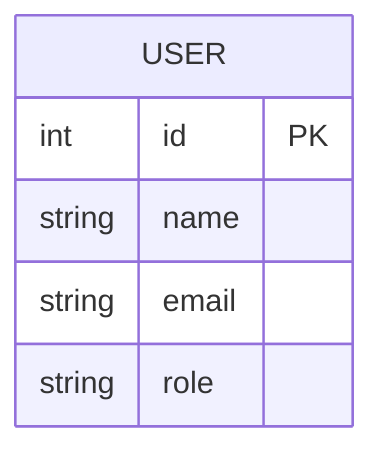
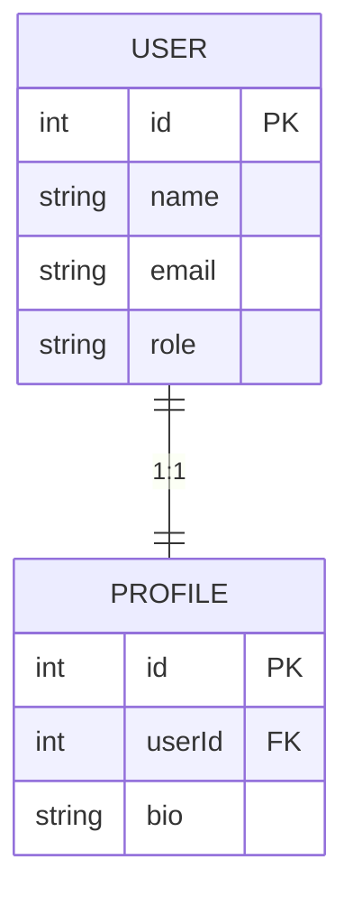

import { Tabs } from "nextra/components";
import { Callout } from "nextra/components";

## Introduction

Currently, FactoryJS does not provide plugins for all ORM libraries, but you can manually define factories to use with other ORMs.

## Installation

You don't need to install any additional packages. Run the following command to install the `@factory-js/factory` package.

<Tabs items={["pnpm", "npm", "yarn"]}>
  <Tabs.Tab>

    ```sh
    pnpm add -D @factory-js/factory
    ```

  </Tabs.Tab>
  <Tabs.Tab>

    ```sh
    npm i --save-dev @factory-js/factory
    ```

  </Tabs.Tab>
  <Tabs.Tab>

    ```sh
    yarn add -D @factory-js/factory
    ```

  </Tabs.Tab>
</Tabs>

## Defining a Simple Model

Let's define a simple model without relations. Here, we'll use an example with [Drizzle ORM](https://orm.drizzle.team/).



To define a factory, use `.define`. In the example below, we use [Faker](https://fakerjs.dev/) to generate values, but you can use any library or fixed values.

```ts filename="factories/user-factory.ts"
import { factory } from "@factory-js/factory";
import { faker } from "@faker-js/faker";
// `create` is a function that calls the Drizzle API to save data to the database
import { create } from "./utils/create";

export const userFactory = factory.define(
  {
    props: {
      name: () => faker.string.alphanumeric(40),
      email: () => faker.internet.exampleEmail(),
      role: () => faker.helpers.arrayElement(["guest", "admin"] as const),
    },
    vars: {},
  },
  // The second argument is a function to save the model
  (props) => create(users, props),
);
```

<Callout type="info">
  For a working sample code, check the [example
  directory](https://github.com/factory-js/factory-js/tree/main/examples/basic).
</Callout>

As an example of using the factory defined above, let's write a simple test. The following is a function that determines if a user is an admin. By calling `.create`, you can get the result saved to the database.

```ts filename="src/is-admin.test.ts"
import { expect, it, describe } from "vitest";
import { userFactory } from "../factories/user-factory";
import { isAdmin } from "./is-admin";

describe("when a user is admin", () => {
  it("returns true", async () => {
    // To create an admin user, set the `role` to `admin` with `.props`
    const user = await userFactory.props({ role: () => "admin" }).create();
    expect(isAdmin(user)).toBe(true);
  });
});
```

## Defining Relations

When defining models with one-to-one or one-to-many relationships, there are two ways to do it. Let's consider a model with a one-to-one relationship. The profile model must always be linked to the user model in a one-to-one relationship.



### Method Without Using Variables

The first method is a simple one that doesn't use variables. Define the factories as in the previous example.

```ts filename="factories/index.ts"
import { factory } from "@factory-js/factory";
import { faker } from "@faker-js/faker";
import { create } from "./utils/create";

// Define the user factory
export const userFactory = factory.define(
  {
    props: {
      name: () => faker.string.alphanumeric(40),
      email: () => faker.internet.exampleEmail(),
      role: () => faker.helpers.arrayElement(["guest", "admin"] as const),
    },
    vars: {},
  },
  (props) => create(users, props),
);

// Define the profile factory
export const profileFactory = factory.define(
  {
    props: {
      // By using `later`, an exception will be thrown
      // if `.props` to set `userId` later is forgotten
      userId: later<number>(),
      bio: () => faker.string.alphanumeric(40),
    },
    vars: {},
  },
  (props) => create(profiles, props),
);
```

When using these, you can specify the model ID with `.props` to link the relationships. In the example below, we create a user first, and then create a profile linked to that user ID.

```ts {7-10} filename="src/get-profile.test.ts"
import { expect, it, describe } from "vitest";
import { userFactory, profileFactory } from "../factories";
import { getProfile } from "./get-profile";

describe("when a user exists", () => {
  it("returns the user profile", async () => {
    const user = await userFactory.create();
    const profile = await profileFactory
      .props({ userId: () => user.id })
      .create();

    await expect(getProfile(user.id)).resolves.toStrictEqual({
      name: user.name,
      bio: profile.bio,
    });
  });
});
```

### Method Using Variables

The second method uses variables. By using variables, you can set default related models, so you don't need to specify the relationships each time you use them.

```ts filename="factories/index.ts"
import { factory } from "@factory-js/factory";
import { faker } from "@faker-js/faker";
import { create } from "./utils/create";

const userFactory = factory.define(
  {
    props: {
      name: () => faker.string.alphanumeric(40),
      email: () => faker.internet.exampleEmail(),
      role: () => faker.helpers.arrayElement(["guest", "admin"] as const),
    },
    vars: {},
  },
  (props) => create(users, props),
);

const profileFactory = factory
  .define(
    {
      props: {
        userId: later<number>(),
        bio: () => faker.string.alphanumeric(40),
      },
      vars: {
        // Store the default user in a variable
        user: () => userFactory.create(),
      },
    },
    (props) => create(profiles, props),
  )
  .props({
    // Use the variable to get the user's ID and set it to `userId`
    userId: async ({ vars }) => (await vars.user).id,
  });
```

<Callout type="info">
  For more details on how to use variables, refer to
  [Variable](../guide/variable.mdx).
</Callout>

This allows you to create the profile model without having to create the user model.

```ts filename="src/get-profile.test.ts"
import { expect, it, describe } from "vitest";
import { userFactory, profileFactory } from "../factories";
import { isValidProfile } from "./is-valid-profile";

describe("when a profile is valid", () => {
  it("returns true", async () => {
    // Create a profile using the default user
    const profile = await profileFactory.create();
    await expect(isValidProfile(profile)).resolves.toBe(true);
  });
});
```

Of course, you can also change the relationships as needed using `.vars`. In the example below, we want to create a profile for an admin user, so we change the relationship using `.vars`.

```ts {3-4}
describe("when a user is admin", () => {
  it("returns true", async () => {
    const user = await userFactory.props({ role: () => "admin" }).create();
    const profile = await profileFactory.vars({ user: () => user }).create();

    await expect(isAdminProfile(user.id)).resolves.toBe(true);
  });
});
```

Which method to use is a matter of preference, but if in doubt, it is recommended to use variables as it can reduce the amount of code.
