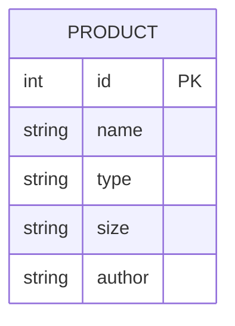
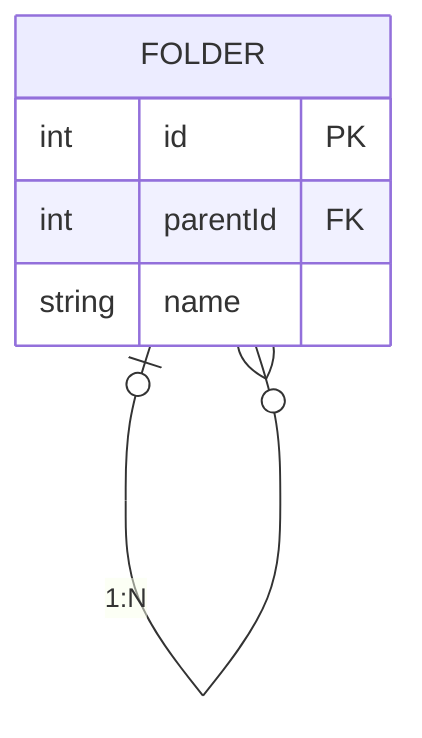

import { Tabs } from "nextra/components";
import { Callout } from "nextra/components";

## Defining STI

[Single-table inheritance](https://www.prisma.io/docs/orm/prisma-schema/data-model/table-inheritance#single-table-inheritance-sti) (STI) is a method of defining multiple types of models in a single table. Depending on the model type, some values may be required or hold different values. In such cases, using `.trait` is convenient. Let's consider the following model. The Product model is divided into Book and Clothing types. For Book, `author` is required, and for Clothing, `size` is required.



You can define the factory as follows:

```ts filename="factories/product-factory.ts"
import { factory } from "@factory-js/factory";
import { faker } from "@faker-js/faker";
import { create } from "./utils/create";

type Size = "small" | "medium" | "large";

export const productFactory = factory
  .define(
    {
      props: {
        name: () => faker.string.alphanumeric(40),
        type: later<"book" | "clothing">(),
        size: (): Size | null => null, // "clothing" only
        author: (): string | null => null, // "book" only
      },
      vars: {},
    },
    (props) => create(products, props),
  )
  .traits({
    book: {
      props: {
        type: () => "book",
        author: () => faker.string.alphanumeric(40),
      },
    },
    clothing: {
      props: {
        type: () => "clothing",
        size: () => rand(["small", "medium", "large"]),
      },
    },
  });
```

To use it, specify the model type with `.use`. The example below writes a test for the Book case.

```ts {7} filename="src/get-product.test.ts"
import { describe, expect, it } from "vitest";
import { productFactory } from "../factories/product-factory";
import { getProduct } from "./sti";

describe("when a product type is book", () => {
  it("returns the book", async () => {
    const book = await productFactory.use((t) => t.book).create();
    await expect(getProduct(book.id)).resolves.toStrictEqual({
      author: book.author,
      name: book.name,
    });
  });
});
```

By managing with `.trait`, you can keep the factory definition concise, and it becomes easier to modify the factory when new columns are added to the table later.

## Defining Self-relations

Defining models with self-referencing relations can feel quite complex, but you can define the factory just like any other relation. Let's consider the example of folders. A folder can have a parent folder, referencing the same table. Root folders do not have a parent, so `parentId` is `null`.



You can define the factory as follows:

```ts filename="factories/folder-factory.ts"
import { factory, later } from "@factory-js/factory";
import { faker } from "@faker-js/faker";
import { folders } from "../schema";
import { create } from "./utils/create";

// Use Drizzle's `$inferSelect` to get the type of the Folder model
type Folder = (typeof folders)["$inferSelect"];

export const folderFactory = factory
  .define(
    {
      props: {
        name: () => faker.string.alphanumeric(40),
        parentId: later<number | null>(),
      },
      vars: {
        // To avoid infinite loops, the default is a root folder without a parent
        parent: (): Folder | undefined => undefined,
      },
    },
    (props) => create(folders, props),
  )
  .props({
    parentId: async ({ vars }) => (await vars.parent)?.id ?? null,
  });
```

To use it, you can create folder models as usual with `.create`. The example below creates a root folder and two child folders.

```ts filename="src/get-child-folders.test.ts"
import { describe, expect, it } from "vitest";
import { folderFactory } from "../factories/folder-factory";
import { getChildFolders } from "./self-relation";

describe("when a folder has children", () => {
  it("returns the folder tree", async () => {
    // Create a root folder
    const parent = await folderFactory.create();
    // Create two child folders
    const children = await folderFactory
      .vars({ parent: () => parent })
      .createList(2);

    await expect(getChildFolders(parent.id)).resolves.toStrictEqual([
      { name: children[0]?.name, children: [] },
      { name: children[1]?.name, children: [] },
    ]);
  });
});
```
